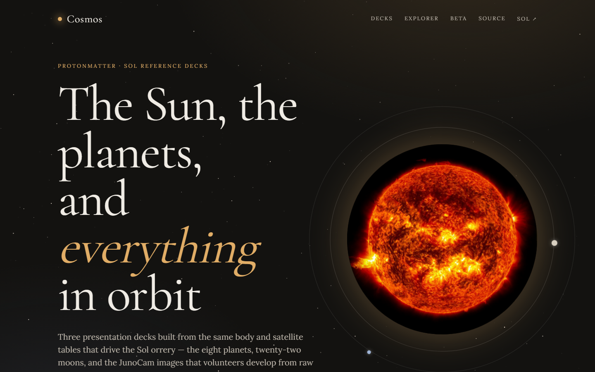
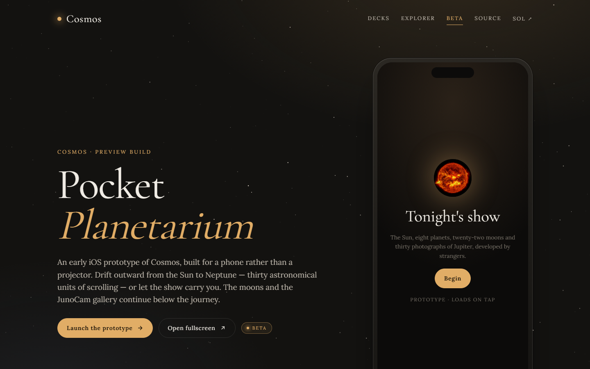

# Cosmos

**Live site: https://protonmatter.github.io/cosmos/**

A landing page, three presentation decks on the solar system — the planets, the moons, and
JunoCam — the JunoCam explorer and poster, and a beta iOS prototype called the Pocket
Planetarium. Built as standalone HTML: no build step and nothing to install. Open any file
in a browser, or serve the folder.

[`index.html`](index.html) is the interactive landing page. It links every deck, the beta
preview, and on to [Sol](https://protonmatter.github.io/sol/).



## What's here

| File | Format | What it covers |
| --- | --- | --- |
| [`index.html`](index.html) | landing | Showcase page for the collection, with links to the beta and through to Sol |
| [`solar-system.dc.html`](solar-system.dc.html) | 13 slides | The Sun, the eight planets and the Moon — one card each, with radius, mass, gravity, rotation, tilt, temperature, atmosphere and field strength |
| [`the-moons.dc.html`](the-moons.dc.html) | 18 slides | Twenty-two moons across five systems: Mars, the Galileans, Saturn's ice moons and Titan, the Uranian five, Neptune's three |
| [`junocam-deck.dc.html`](junocam-deck.dc.html) | 11 slides | JunoCam itself: the instrument, why its images arrive as raw strips, and the volunteers who process them |
| [`junocam-explorer.dc.html`](junocam-explorer.dc.html) | interactive | The thirty processed Jupiter frames, filterable by region and treatment, with a zoomable viewer and a side-by-side compare mode |
| [`junocam-poster.dc.html`](junocam-poster.dc.html) | 18 × 24 in | A single printable sheet on the same subject |
| [`beta.html`](beta.html) | landing | Preview page for the beta, introducing the Pocket Planetarium |
| [`pocket-planetarium.html`](pocket-planetarium.html) | beta / iOS | A scroll-driven journey from the Sun out to Neptune, with the moons and the JunoCam gallery below |

The decks are 1920 × 1080 and scale to fit the window. The poster prints at 18 × 24 inches.

The pages are plain HTML that declare their content declaratively; `support.js`,
`deck-stage.js` and `deck-cinema.js` provide the slide runtime, and `classical.css` the
shared look.

## Pocket Planetarium (beta)

An early iOS prototype of Cosmos as a single scrollable app: the Sun, eight planets,
twenty-two moons and the thirty JunoCam photographs. [`beta.html`](beta.html) introduces
it and, on a desktop browser, presents it inside a simulated 390 × 844 device frame:



On an iPhone, open [`pocket-planetarium.html`](pocket-planetarium.html) full screen
instead for the intended experience:


Its assets live under [`beta/pocket-planetarium/`](beta/pocket-planetarium/). This is a
prototype, not a release — the decks are unaffected by anything in it.

## Using them

Open a file directly, or serve the folder:

```
python3 -m http.server 8000
```

then visit `localhost:8000/` for the landing page (or any file above).

Arrow keys or space advance the decks. Print to PDF gives one page per slide.

## Publishing on GitHub Pages

[`.github/workflows/pages.yml`](.github/workflows/pages.yml) deploys the repo root on
every push to `main` (Settings → Pages → Source: *GitHub Actions*). React, ReactDOM and
Babel are vendored under `vendor/` so the pages have no CDN dependency; only the Google
Fonts stylesheet is fetched remotely.

## Where the numbers come from

Every figure in the decks is read from the body and satellite tables in
[Protonmatter/sol](https://github.com/Protonmatter/sol) — `apps/web/js/bodyData.js` and
`apps/web/js/moons.js` — which cite the NASA Planetary Fact Sheets and IAU WGCCRE 2015
(Archinal et al. 2018) for radii and rotation. The descriptive text is that project's own,
unchanged.

Each deck ends with a sources slide giving per-image provenance.

## Image credits

Spacecraft imagery is NASA/JPL-Caltech and partner institutions, in the public domain:

- **Sun and planets** — SDO (Sun), MESSENGER (Mercury), Magellan (Venus), DSCOVR (Earth),
  Viking (Mars), JunoCam (Jupiter), Cassini (Saturn), Voyager 2 (Uranus, Neptune)
- **Moons** — Voyager 1 and 2, Galileo, Cassini–Huygens, Juno, Mars Reconnaissance Orbiter
- **Jupiter and Io frames** (`images/`) — JunoCam raw data processed by volunteers, from
  the [Mission Juno citizen-processing
  gallery](https://www.missionjuno.swri.edu/junocam/processing)
  (NASA/JPL-Caltech/SwRI/MSSS)

Two files are **not** public domain and are used under **CC BY 4.0**: `textures/moon.jpg`
and `textures/saturn_ring.png`, from [Solar System
Scope](https://www.solarsystemscope.com/textures/), which composites NASA source data.

Some small or distant moons are shown as enlarged crops of low-resolution frames — Nereid
especially, which Voyager 2 resolved to only a few dozen pixels. The sources slides say
which.

Typography is Cormorant Garamond and Lora, both under the SIL Open Font License.

## Licence

Deck code and layout: MIT, see [`LICENSE`](LICENSE). Imagery and figures keep the terms
above; MIT does not extend to them.
